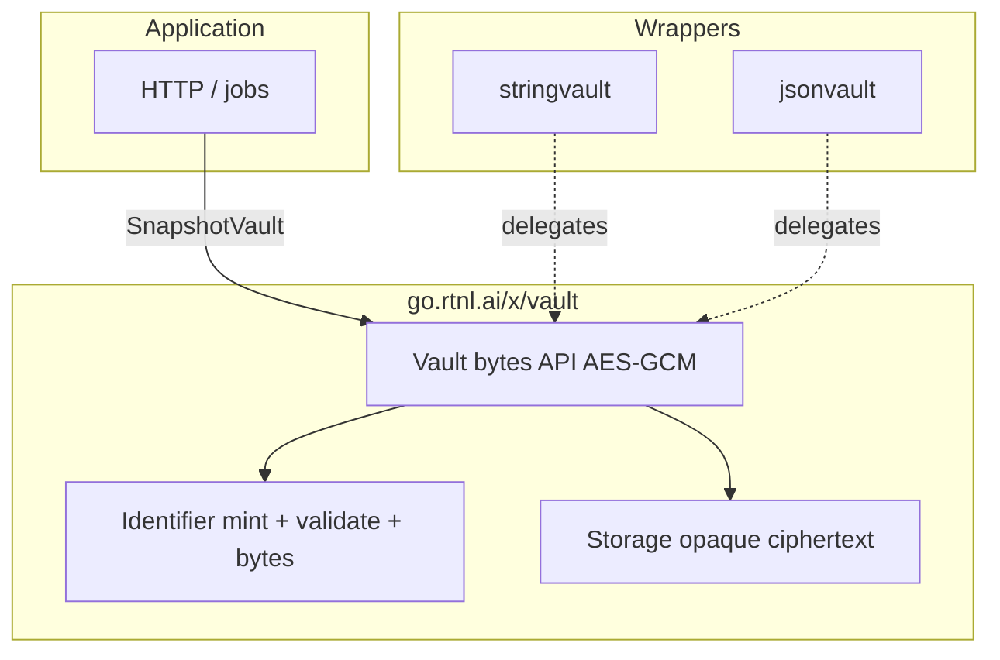
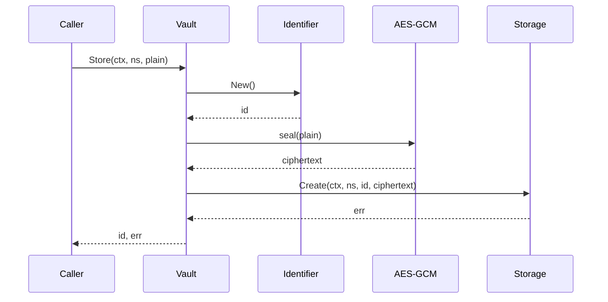
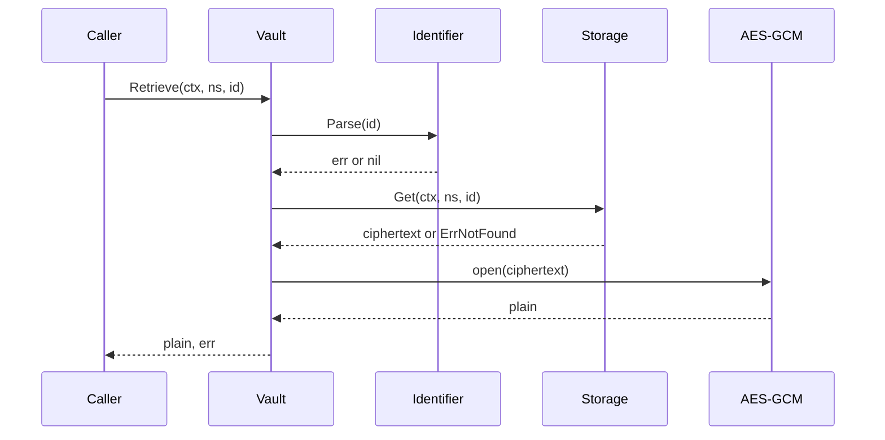
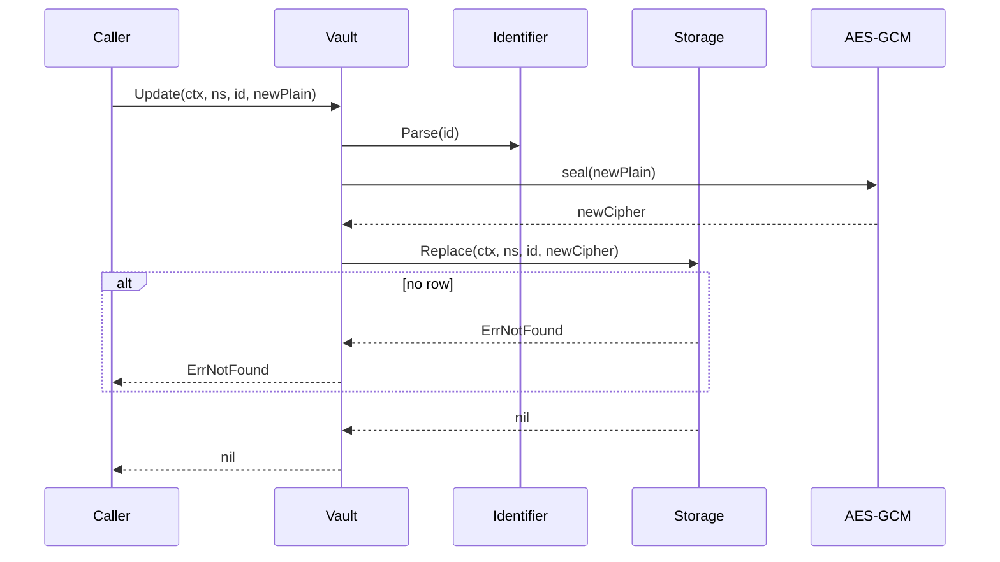
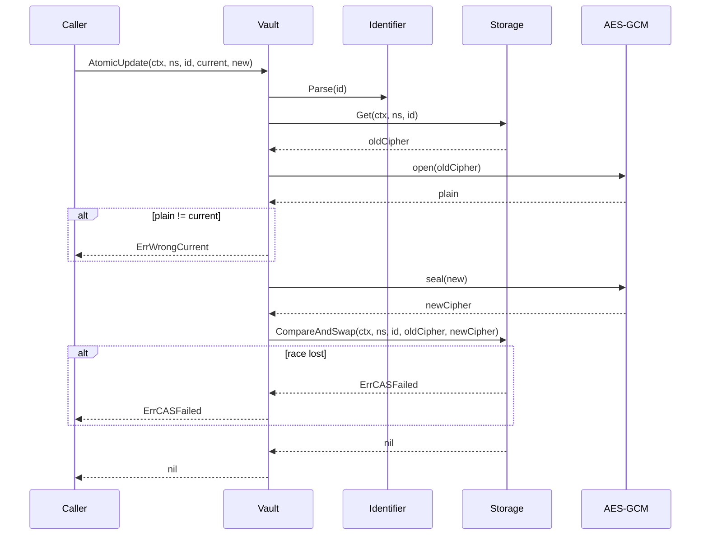
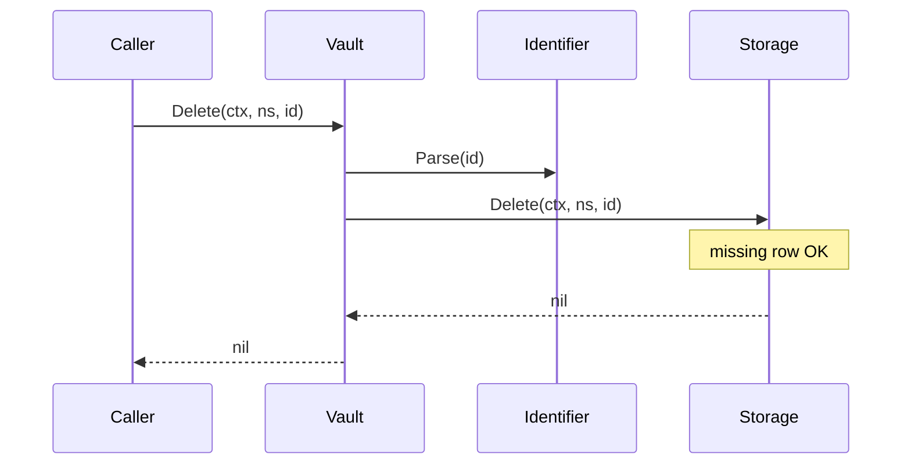
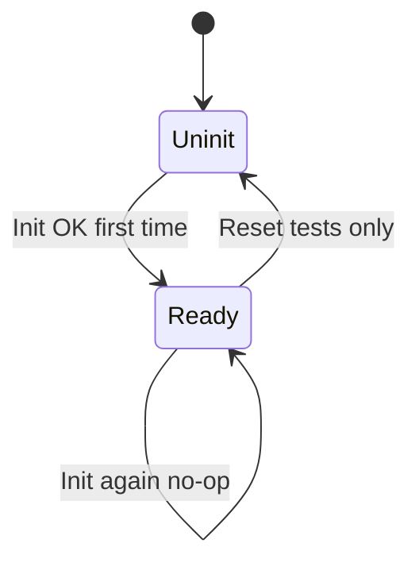
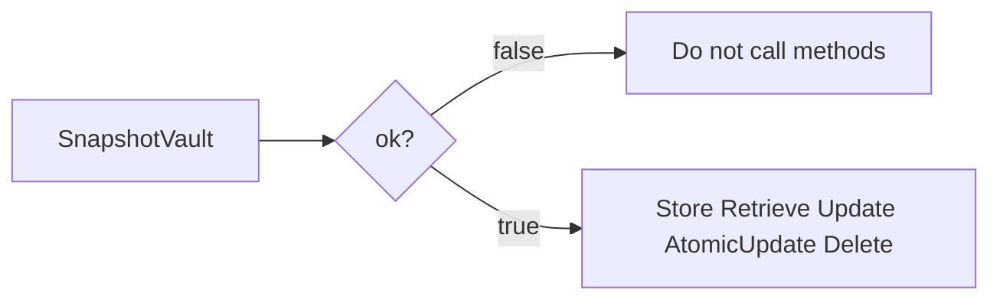

# vault

[`go.rtnl.ai/x/vault`](https://pkg.go.dev/go.rtnl.ai/x/vault) encrypts application secrets at rest with **AES-256-GCM** and persists **opaque ciphertext** through a small [`Storage`](./storage.go) interface. Logical secret ids are minted and validated through [`Identifier`](./identifier.go).

**Important:** The **namespace** argument is not just a storage partition—it is mixed into **GCM additional authenticated data (AAD)** when sealing. Use the **same namespace string** on `Retrieve`, `Update`, and `AtomicUpdate` as on `Store`, or call **`MoveNamespace`** when relocating a secret; otherwise reads fail with decrypt/authentication errors.

Helpers for common payload shapes:

- [`stringvault`](./stringvault/) — UTF-8 strings (bytes on the wire are valid UTF-8)
- [`jsonvault`](./jsonvault/) — `encoding/json` values

---

## Quick start (examples)

### Bytes API with an isolated [`Vault`](./vault.go)

Use [`New`](./vault.go) when you want a dedicated instance (tests, workers, or libraries that should not use the process singleton). The AES key must be **exactly 32 bytes (AES-256)**; here we use `make([]byte, 32)` only for illustration—**use `crypto/rand` or a KMS-derived key in production.**

[`vaulttest`](./vaulttest/) supplies an in-memory [`MemStorage`](./vaulttest/storage.go) and a simple [`HexIdentifier`](./vaulttest/identifier.go); swap these for your real `Storage` and `Identifier` implementations.

```go
ctx := context.Background()
key := make([]byte, 32) // production: 32 random bytes (e.g. crypto/rand)

v, err := vault.New(key, vaulttest.NewMemStorage(), vaulttest.HexIdentifier{})
if err != nil {
    return err
}

id, err := v.Store(ctx, "my-app", []byte("secret-payload"))
if err != nil {
    return err
}

plain, err := v.Retrieve(ctx, "my-app", id)
if err != nil {
    return err
}
_ = plain // []byte("secret-payload")
```

### Process-wide singleton ([`Init`](./vault.go) / [`SnapshotVault`](./vault.go))

Some apps wire one vault for the whole process (similar to other Rotational codebases). [`Init`](./vault.go) runs once ([`sync.Once`](https://pkg.go.dev/sync#Once)); later calls are no-ops and repeat the first error if initialization failed. [`SnapshotVault`](./vault.go) returns `(vault *Vault, ok bool)` — only call methods when `ok` is true.

```go
if err := vault.Init(key, myStorage, myIdentifier); err != nil {
    log.Fatal(err)
}
v, ok := vault.SnapshotVault()
if !ok {
    return errors.New("vault not initialized")
}
id, err := v.Store(ctx, "ns", []byte("data"))
```

[`Reset`](./vault.go) clears the singleton **for tests only** so another `Init` can run in the same process.

### UTF-8 strings ([`stringvault`](./stringvault/))

[`stringvault.New`](./stringvault/stringvault.go) wraps an existing `*vault.Vault`. Invalid UTF-8 inputs return [`stringvault.ErrInvalidUTF8`](./stringvault/stringvault.go).

```go
core, err := vault.New(key, st, idGen)
if err != nil {
    return err
}
w := stringvault.New(core)

sid, err := w.Store(ctx, "ns", "hello")
if err != nil {
    return err
}
s, err := w.Retrieve(ctx, "ns", sid)
```

### JSON values ([`jsonvault`](./jsonvault/))

[`Store`](./jsonvault/jsonvault.go) marshals with [`json.Marshal`](https://pkg.go.dev/encoding/json#Marshal); [`Retrieve`](./jsonvault/jsonvault.go) unmarshals into a type parameter. For [`AtomicUpdate`](./jsonvault/jsonvault.go), **equality is JSON bytes**: use stable struct tags and consistent types so `current` and `new` marshal the way you expect.

```go
core, err := vault.New(key, st, idGen)
if err != nil {
    return err
}
jw := jsonvault.New(core)

type Payload struct {
    N int `json:"n"`
}

jid, err := jw.Store(ctx, "ns", Payload{N: 1})
if err != nil {
    return err
}

// Separated because markdown can't handle Go generics because that's the same
// regex as MD links (like: "[TEXT](URL)" vs "FuncName[GENERICS](ARGS)")
retrievePayload := jsonvault.Retrieve[Payload]
got, err := retrievePayload(jw, ctx, "ns", jid)
_ = got // got is a Payload struct after retrieval
```

---

## Implementing [`Storage`](./storage.go)

`Storage` persists **ciphertext blobs only** — the `Vault` seals plaintext before calling you. Keys are `(namespace, id string)`; both are opaque to `vault` (your backend chooses namespaces and id encoding). Blobs are cryptographically bound to the namespace string at seal time (see **Important** above); **do not rename** or substitute a different namespace for calls without going through **`MoveNamespace`** or callers will see decrypt/authentication failures.

| Method | Contract |
|--------|----------|
| **`Create`** | Insert-only. If `(namespace, id)` already exists, return an error; use [`ErrDuplicateKey`](./errors.go) when that fits so callers can recognize duplicates. |
| **`Get`** | Return the stored blob or [`ErrNotFound`](./errors.go). |
| **`Replace`** | Overwrite ciphertext for an existing row; missing row → [`ErrNotFound`](./errors.go). |
| **`Delete`** | Remove the row if present; **missing row should still return `nil`** (idempotent delete). |
| **`CompareAndSwap`** | Set `newCiphertext` **only if** the stored value equals `oldCiphertext`. Wrong old value → [`ErrCASFailed`](./errors.go). Missing row → [`ErrNotFound`](./errors.go). |

[`AtomicUpdate`](./vault.go) on `Vault` depends on correct CAS semantics: a lost race or stale `oldCiphertext` must surface [`ErrCASFailed`](./errors.go), not a generic error, so callers can use [`errors.Is`](https://pkg.go.dev/errors#Is).

For Postgres/SQL, map “duplicate key” and “no row” from your driver to the sentinels above where practical.

**Validate implementations** with [`vaulttest.Run`](./vaulttest/conformance.go): pass a factory that returns a fresh `Storage` per subtest.

---

## Implementing [`Identifier`](./identifier.go)

`Identifier` separates **id minting** from **storage**:

- **`New`** — Called when creating a secret; returns a new **string id** (e.g. ULID, UUID, or hex).
- **`Parse`** — Validates any id passed into `Retrieve`, `Update`, `AtomicUpdate`, or `Delete`. Return an error if the string is malformed.
- **`IDFromBytes` / `BytesFromID`** — Optional bridge when your database stores raw binary ids (e.g. `BYTEA` ULID) but the vault API uses string ids. Implementations should round-trip consistently so the same logical secret shares one string form at the vault layer.

On **`Store`**, the vault calls **`New()`** to mint the id, then encrypts and **`Create`**s with that id. On read/update paths it calls **`Parse(id)`** before touching storage.

[`vaulttest.HexIdentifier`](./vaulttest/identifier.go) is a small stdlib-only example (random 16 bytes → 32 hex chars).

---

## Sentinel errors

Exported sentinels and what they mean are documented on each variable in [`errors.go`](./errors.go) (see also [`pkg.go.dev`](https://pkg.go.dev/go.rtnl.ai/x/vault)). Use [`errors.Is`](https://pkg.go.dev/errors#Is) for stable classification; crypto and storage failures often use [`errors.Join`](https://pkg.go.dev/errors#Join)(sentinel, underlying).

---

## Testing

- [`vaulttest`](./vaulttest/) — Plaintext-through-storage [`TestVault`](./vaulttest/vault.go) (no AES), in-memory [`MemStorage`](./vaulttest/storage.go), and [`Run`](./vaulttest/conformance.go) to conformance-test any [`Storage`](./storage.go).

---

## Reference: architecture

Application code uses either [`Init`](./vault.go) / [`SnapshotVault`](./vault.go) or [`New`](./vault.go). Implementations supply [`Identifier`](./identifier.go) and [`Storage`](./storage.go). Wrappers delegate to the same [`Vault`](./vault.go).



---

## Reference: operations (sequence diagrams)

### Store



### Retrieve



### Update (blind replace)



### AtomicUpdate (compare-and-swap)



### Delete



### Singleton lifecycle




